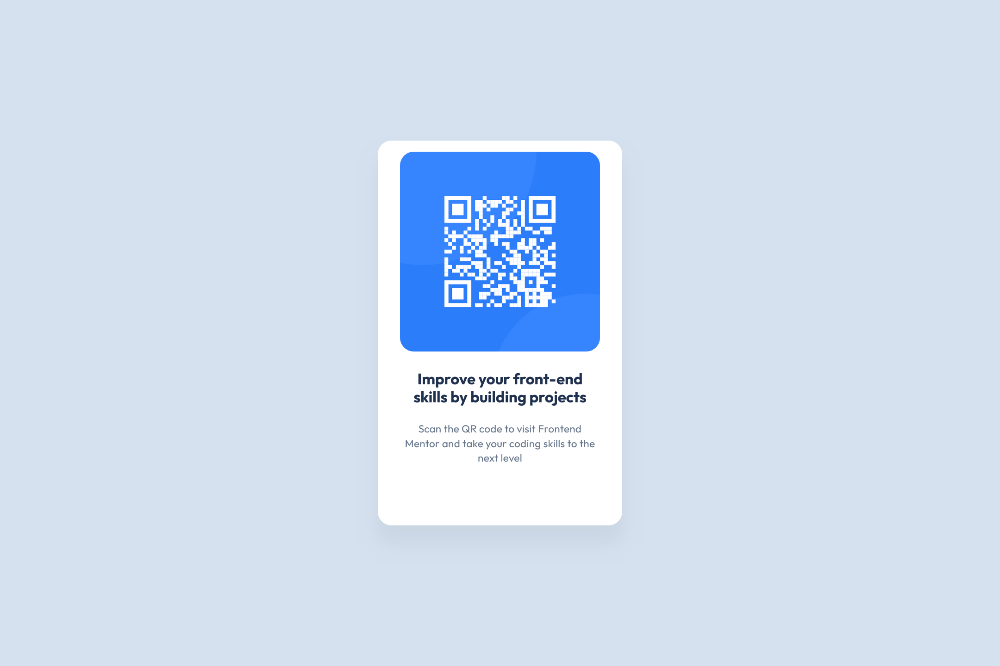

# Frontend Mentor - QR code component solution

This is a solution to the [QR code component challenge on Frontend Mentor](https://www.frontendmentor.io/challenges/qr-code-component-iux_sIO_H). Frontend Mentor challenges help you improve your coding skills by building realistic projects. 

## Table of contents

- [Overview](#overview)
  - [Screenshot](#screenshot)
  - [Links](#links)
- [My process](#my-process)
  - [Built with](#built-with)
  - [Continued development](#continued-development)
  - [Useful resources](#useful-resources)
- [Author](#author)
- [Acknowledgments](#acknowledgments)

**Note: Delete this note and update the table of contents based on what sections you keep.**

## Overview

### Screenshot

### Links

- Solution URL: [Add solution URL here](https://github.com/Am1rGhe/Qr-code-component)
- Live Site URL: [Add live site URL here] sorry didn't know how to do it .

## My process

- So I started with creating the div which called container that contains all the project (the light blue background).
- Inside the container , i created the informations container div which represents the square in the middle holding the       paragraphs and the image
- I added 2 divs inside it , first one for the image and the second one for the informations below.
- i made the display flex so i can adjust them in the middle in a column direction .
- than i followed the widths and heights of the figma design for the pc version. 
- Same thing for the informations.
-In the end , i adjusted the width and height for the phone verson using media query. 
### Built with

- Semantic HTML5 markup
- CSS custom properties

### Continued development

This is the first project , i didn't find much difficulties , we'll see for the next ones

### Useful resources

## Author

- Amir Ghouari
- Frontend Mentor - [@Am1rGhe](https://www.frontendmentor.io/profile/Am1rGhe)

## Acknowledgments
